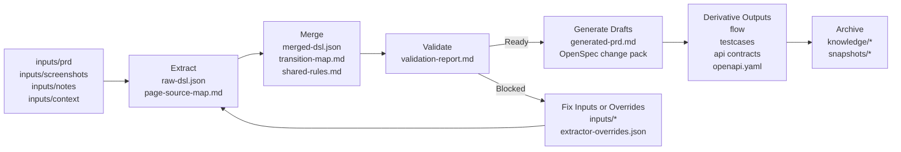
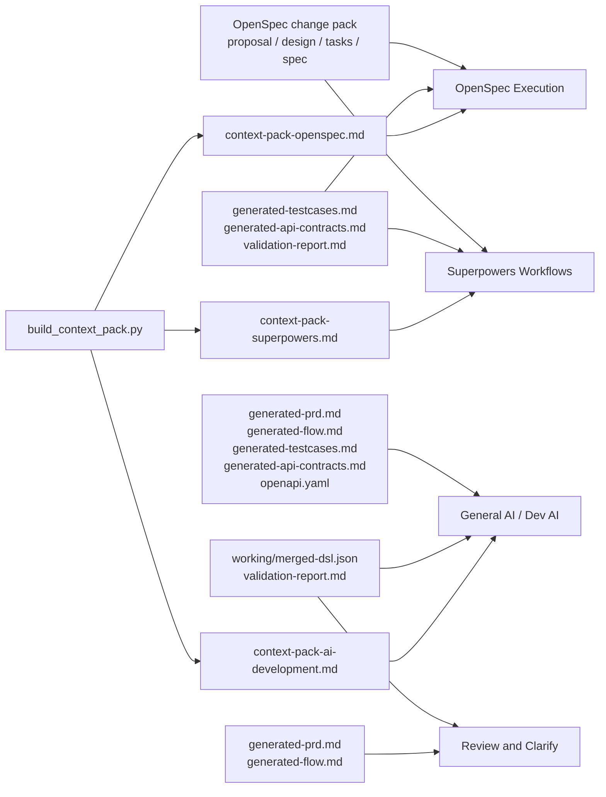

# prd-spec-workspace

A generic requirement-to-spec workspace for turning PRDs, screenshots, notes, and context files into structured DSL, reviewable specs, OpenSpec change packs, test cases, flows, API drafts, and reusable context packs.

Chinese version: [README_CN.md](D:/spring_AI/prd-spec-workspace/README_CN.md).

## Start Here

If you are opening this repository for the first time, start from these entry points:

- [Documentation Index](D:/spring_AI/prd-spec-workspace/docs/README.md)
- [Chinese Documentation Index](D:/spring_AI/prd-spec-workspace/docs/README_CN.md)
- [README_CN.md](D:/spring_AI/prd-spec-workspace/README_CN.md)
- [GUIDE_CN.md](D:/spring_AI/prd-spec-workspace/GUIDE_CN.md)
- [New Requirement SOP (CN)](D:/spring_AI/prd-spec-workspace/docs/new-requirement-sop_cn.md)
- [Artifact Usage Guide (CN)](D:/spring_AI/prd-spec-workspace/docs/artifact-usage-guide_cn.md)
- [Context Pack Assembly Guide (CN)](D:/spring_AI/prd-spec-workspace/docs/context-pack-assembly-guide_cn.md)
- [AI Dialogue Requirement Workflow](D:/spring_AI/prd-spec-workspace/docs/ai-dialogue-requirement-workflow.md)

## What This Project Is

This repository is a tooling workspace for multimodal requirement understanding and spec generation.

It helps teams take mixed requirement inputs such as:

- product requirement documents
- screenshots or prototypes
- meeting notes
- interface or permission context
- flow descriptions or diagrams

and convert them into a consistent set of structured outputs.

The core idea is:

`raw requirement materials -> structured DSL -> validation -> spec artifacts -> reusable knowledge`

This project is tool-oriented, not business-template-oriented.

## Structured Understanding and Confidence Transparency

The platform improves quality through two principles:

- normalize multimodal requirement inputs into a structured intermediate layer before drafting outputs
- expose evidence and confidence so users can review what is solid, inferred, or still uncertain

Its goal remains multimodal requirement recognition and conversion into executable spec artifacts.

## End-to-End Flow



## What Users Actually Get

After one requirement run, a team usually gets three kinds of value:

- a structured requirement core for understanding and validation
- reviewable specs for product, QA, and engineering alignment
- ready-to-copy context packs for downstream execution tools

## Output-to-Tool Map



## Three Ways to Use the Platform

### 1. Dialogue-first AI usage

Use this mode when the requirement is new, ambiguous, or prototype-heavy.

Recommended flow:

1. Put materials into `inputs/`.
2. Ask AI to do structured recognition first.
3. Review pages, actions, rules, transitions, dependencies, and unknowns.
4. Only continue into Markdown spec generation after the structure looks trustworthy.

A good dialogue prompt is:

```text
This is a new requirement. Please follow the platform rules and do structured recognition first.
Do not write the final draft yet.
Please extract pages, actions, rules, transitions, dependencies, and unknowns from inputs/ first,
and then judge whether the requirement is ready for downstream spec generation.
```

See also:

- [AI Dialogue Requirement Workflow](D:/spring_AI/prd-spec-workspace/docs/ai-dialogue-requirement-workflow.md)

### 2. Script-first usage

Use this mode when the inputs are already fairly complete and you want stable engineered outputs.

Recommended flow:

1. Place materials into `inputs/`.
2. Run `python scripts/run_pipeline.py --change-name <change-name> --domain <domain> --title "<title>"`.
3. Review [merged-dsl.json](D:/spring_AI/prd-spec-workspace/working/merged-dsl.json) and [validation-report.md](D:/spring_AI/prd-spec-workspace/working/validation-report.md).
4. Inspect downstream drafts and derivative outputs.
5. Archive the requirement when stable.

### 3. Vision-enhanced usage

Use this mode when screenshots or prototypes are important evidence and you want OCR plus component verification before DSL extraction.

Recommended flow:

1. Put screenshots into `inputs/screenshots/`.
2. Optionally add sidecar OCR files with the same basename, such as `login.png` with `login.ocr.txt`, `login.ocr.md`, or `login.ocr.json`.
3. Run `python scripts/run_pipeline.py --change-name <change-name> --domain <domain> --title "<title>" --enable-vision`.
4. Review these intermediate artifacts first:
   - [screenshot-evidence.md](D:/spring_AI/prd-spec-workspace/working/screenshot-evidence.md)
   - [screenshot-ocr.json](D:/spring_AI/prd-spec-workspace/working/screenshot-ocr.json)
   - [page-classification.json](D:/spring_AI/prd-spec-workspace/working/page-classification.json)
5. Then review the merged DSL and validation report.

Rules for vision mode:

- It is optional and should be enabled only when screenshots matter.
- It strengthens the Extract stage; it does not replace validation.
- Screenshot evidence must remain transparent. Low-confidence OCR should be reviewed manually.
- If local `tesseract` is unavailable, the platform still works, but OCR confidence will stay low unless sidecar OCR files are provided.

The key distinction is:

- dialogue-first mode emphasizes AI recognition and judgment first
- script-first mode emphasizes repeatable execution first
- vision-enhanced mode adds OCR and component verification before DSL extraction
- all three still follow the same platform principle: structure first, validate second, generate specs third

## Quick Start

```bash
python scripts/bootstrap_outputs.py --change-name demo-change --domain account
python scripts/run_pipeline.py --change-name demo-change --domain account --title "Sample Requirement"
python scripts/run_pipeline.py --change-name demo-change --domain account --title "Sample Requirement" --enable-vision
python scripts/build_context_pack.py --target openspec --change-name demo-change --domain account --title "Sample Requirement"
python scripts/archive_spec.py --change-name demo-change --domain account --title "Sample Requirement"
```

## Documentation

Start with the documentation index:

- [Documentation Index](D:/spring_AI/prd-spec-workspace/docs/README.md)
- [Chinese Documentation Index](D:/spring_AI/prd-spec-workspace/docs/README_CN.md)
- [Artifact Usage Guide (CN)](D:/spring_AI/prd-spec-workspace/docs/artifact-usage-guide_cn.md)
- [Context Pack Assembly Guide (CN)](D:/spring_AI/prd-spec-workspace/docs/context-pack-assembly-guide_cn.md)
- [AI Dialogue Requirement Workflow](D:/spring_AI/prd-spec-workspace/docs/ai-dialogue-requirement-workflow.md)
- [Structured Understanding and Confidence Notes (CN)](D:/spring_AI/prd-spec-workspace/docs/structured-understanding-confidence_cn.md)
- [OCR Extension Guide (CN)](D:/spring_AI/prd-spec-workspace/docs/ocr-extension-guide_cn.md)
- [GUIDE_CN.md](D:/spring_AI/prd-spec-workspace/GUIDE_CN.md)

## Testing

```bash
python -m unittest tests.test_extract_initial_dsl tests.test_extract_screenshot_evidence tests.test_manage_extractor_overrides tests.test_validate_dsl tests.test_generate_drafts tests.test_generate_derivatives tests.test_run_pipeline tests.test_archive_spec tests.test_select_context tests.test_build_context_pack tests.test_accuracy_examples -v
```
