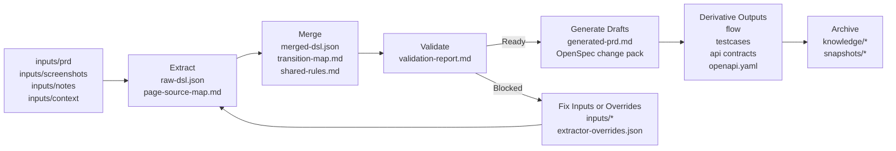

# prd-spec-workspace

A generic requirement-to-spec workspace for turning PRDs, screenshots, notes, and context files into structured DSL, reviewable specs, OpenSpec change packs, test cases, flows, and API drafts.

中文说明见 [README_CN.md](D:/spring_AI/prd-spec-workspace/README_CN.md).

## What This Project Is

This repository is a tooling workspace for requirement analysis.

It is designed to help teams take mixed requirement inputs such as:

- product requirement documents
- screenshots or prototypes
- meeting notes
- interface or permission context
- flow descriptions

and convert them into a consistent set of structured outputs.

The core idea is:

`raw requirement materials -> structured DSL -> validation -> spec artifacts -> reusable knowledge`

This project is intentionally tool-oriented, not business-template-oriented. It should stay generic and let users extend extraction accuracy through configuration instead of hardcoding product domains into the code.

## End-to-End Flow



## Why Use It

This workspace is useful when a team wants to:

- reduce ambiguity before implementation starts
- make requirement analysis more structured and repeatable
- separate confirmed facts from inferred structure and unknowns
- generate implementation-facing artifacts from the same requirement source
- archive reusable knowledge after a requirement is complete
- give AI agents a more stable and reviewable requirement context

## Key Capabilities

### 1. Requirement Extraction

The extractor reads materials from `inputs/` and produces a structured DSL that includes:

- pages
- transitions
- rules
- dependencies
- unknowns

### 2. Validation Before Generation

The pipeline validates the merged DSL before downstream generation, which helps catch:

- isolated pages
- missing exit paths
- invalid transitions
- duplicated ids
- missing dependency declarations
- overly noisy or incomplete extraction results

### 3. Multi-Artifact Generation

From one validated DSL, the workspace can generate:

- Markdown requirement draft
- OpenSpec proposal / design / tasks / spec
- flow diagrams
- test cases
- API contract draft
- OpenAPI YAML skeleton

### 4. Knowledge Archiving

Completed requirements can be archived into `knowledge/` so the workspace can retain reusable assets without polluting the next active requirement.

### 5. User-Extensible Extraction

Teams can improve extraction accuracy without changing Python code by using:

- `extractor-overrides.json`
- `scripts/manage_extractor_overrides.py`

## Standard Outputs

### Working Artifacts

- `working/page-source-map.md`
- `working/raw-dsl.json`
- `working/transition-map.md`
- `working/shared-rules.md`
- `working/merged-dsl.json`
- `working/validation-report.md`
- `working/generated-prd.md`
- `working/generated-flow.md`
- `working/generated-testcases.md`
- `working/generated-api-contracts.md`
- `working/api-contracts/openapi.yaml`

### OpenSpec Change Pack

- `openspec/changes/<change-name>/proposal.md`
- `openspec/changes/<change-name>/design.md`
- `openspec/changes/<change-name>/tasks.md`
- `openspec/changes/<change-name>/specs/<domain>/spec.md`

### Published Outputs

- `outputs/diagrams/`
- `outputs/testcases/`
- `outputs/contracts/`

### Knowledge Outputs

- `knowledge/specs/`
- `knowledge/patterns/`
- `knowledge/rules/`
- `knowledge/api/`
- `knowledge/decisions/`
- `knowledge/snapshots/`

## Repository Layout

```text
inputs/
  prd/
  screenshots/
  notes/
  context/

scripts/
  bootstrap_outputs.py
  extract_initial_dsl.py
  validate_dsl.py
  generate_drafts.py
  generate_derivatives.py
  render_mermaid_assets.py
  archive_spec.py
  select_context.py
  manage_extractor_overrides.py
  run_pipeline.py

working/
openspec/
outputs/
knowledge/
docs/
prompts/
tests/
examples/
```

## Quick Start

### 1. Prepare the workspace

```bash
python scripts/bootstrap_outputs.py --change-name demo-change --domain account
```

### 2. Put materials into `inputs/`

Recommended minimum:

- one PRD or equivalent requirement note
- one notes file
- one context file if interfaces or permissions matter

Best-case input set:

- `prd + screenshots + notes + context + flow evidence`

### 3. Run the pipeline

```bash
python scripts/run_pipeline.py --change-name demo-change --domain account --title "Sample Requirement"
```

### 4. Review generated artifacts

Focus on:

- `working/merged-dsl.json`
- `working/validation-report.md`
- `working/generated-prd.md`
- `working/generated-flow.md`
- `working/generated-testcases.md`
- `working/generated-api-contracts.md`

### 5. Archive when stable

```bash
python scripts/archive_spec.py --change-name demo-change --domain account --title "Sample Requirement"
```

## Typical Commands

```bash
python scripts/bootstrap_outputs.py --change-name my-change --domain account
python scripts/extract_initial_dsl.py --workspace .
python scripts/validate_dsl.py
python scripts/run_pipeline.py --change-name my-change --domain account --title "My Requirement"
python scripts/archive_spec.py --change-name my-change --domain account --title "My Requirement"
python scripts/select_context.py --list
```

## Extending Extraction

If your team uses domain-specific wording, you do not need to edit the extractor code first.

Initialize overrides:

```bash
python scripts/manage_extractor_overrides.py --init
```

Inspect overrides:

```bash
python scripts/manage_extractor_overrides.py --show
```

Extend overrides:

```bash
python scripts/manage_extractor_overrides.py --add-page-suffix 看板
python scripts/manage_extractor_overrides.py --add-action-prefix 导出
python scripts/manage_extractor_overrides.py --add-rule-keyword 实时刷新
python scripts/manage_extractor_overrides.py --add-rule-category 报表规则 --add-category-keyword 实时刷新
```

Detailed guides:

- [Extractor Overrides Guide](D:/spring_AI/prd-spec-workspace/docs/extractor-overrides.md)
- [Extractor Overrides 中文版](D:/spring_AI/prd-spec-workspace/docs/extractor-overrides_cn.md)

## Documentation

- [README_CN.md](D:/spring_AI/prd-spec-workspace/README_CN.md)
- [Guide](D:/spring_AI/prd-spec-workspace/guide.md)
- [GUIDE_CN.md](D:/spring_AI/prd-spec-workspace/GUIDE_CN.md)
- [Direct Use Checklist](D:/spring_AI/prd-spec-workspace/docs/direct-use-checklist.md)
- [New Requirement SOP (CN)](D:/spring_AI/prd-spec-workspace/docs/new-requirement-sop_cn.md)
- [Project Handbook (CN)](D:/spring_AI/prd-spec-workspace/docs/project-handbook_cn.md)
- [Artifact Usage Guide (CN)](D:/spring_AI/prd-spec-workspace/docs/artifact-usage-guide_cn.md)
- [Context Pack Templates (CN)](D:/spring_AI/prd-spec-workspace/docs/context-pack-templates/README_CN.md)
- [Extractor Overrides Guide](D:/spring_AI/prd-spec-workspace/docs/extractor-overrides.md)
- [Contributing](D:/spring_AI/prd-spec-workspace/CONTRIBUTING.md)
- [CHANGELOG](D:/spring_AI/prd-spec-workspace/CHANGELOG.md)

## Examples

- [Examples README](D:/spring_AI/prd-spec-workspace/examples/README.md)
- [auth-basic](D:/spring_AI/prd-spec-workspace/examples/auth-basic)
- [payment-refund](D:/spring_AI/prd-spec-workspace/examples/payment-refund)
- [reporting-dashboard](D:/spring_AI/prd-spec-workspace/examples/reporting-dashboard)

## Testing

```bash
python -m unittest tests.test_extract_initial_dsl tests.test_manage_extractor_overrides tests.test_validate_dsl tests.test_generate_drafts tests.test_generate_derivatives tests.test_run_pipeline tests.test_archive_spec tests.test_select_context -v
```

## Contributing

If you want to contribute, start with:

- [Contributing](D:/spring_AI/prd-spec-workspace/CONTRIBUTING.md)
- [.github/ISSUE_TEMPLATE/bug_report.md](D:/spring_AI/prd-spec-workspace/.github/ISSUE_TEMPLATE/bug_report.md)
- [.github/ISSUE_TEMPLATE/feature_request.md](D:/spring_AI/prd-spec-workspace/.github/ISSUE_TEMPLATE/feature_request.md)

## License

This repository uses MIT:

- [LICENSE](D:/spring_AI/prd-spec-workspace/LICENSE)
