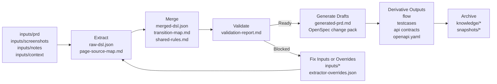
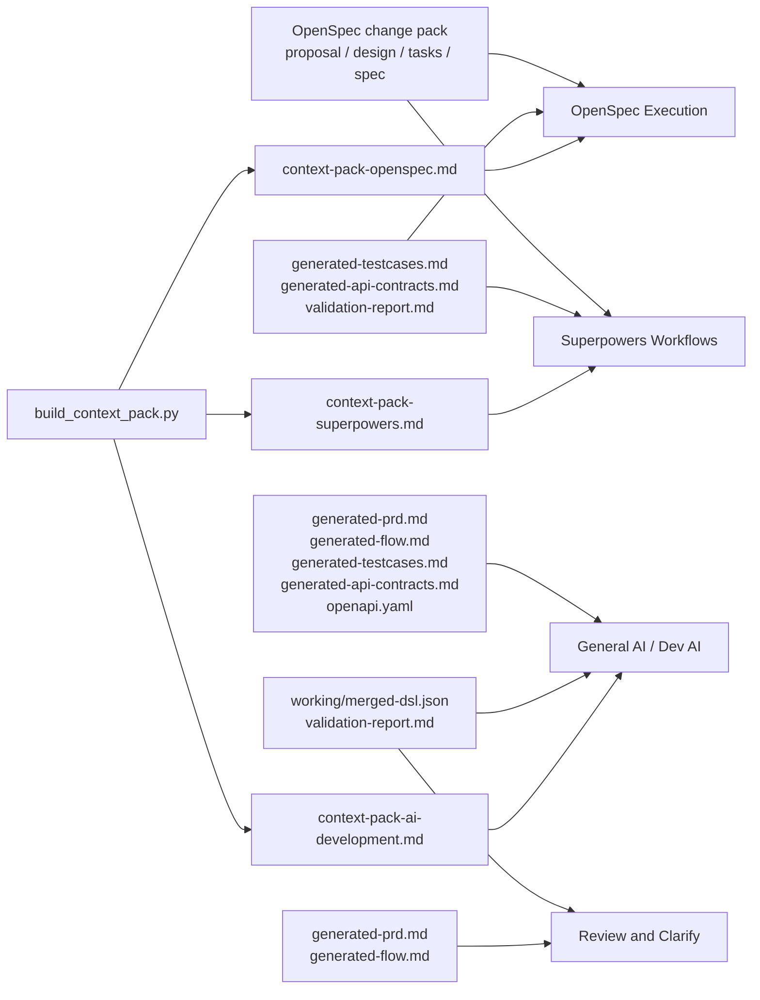

# prd-spec-workspace

A generic requirement-to-spec workspace for turning PRDs, screenshots, notes, and context files into structured DSL, reviewable specs, OpenSpec change packs, test cases, flows, and API drafts.

Chinese version: [README_CN.md](D:/spring_AI/prd-spec-workspace/README_CN.md).

## Start Here

If you are opening this repository for the first time, use these entry points first:

- [Documentation Index](D:/spring_AI/prd-spec-workspace/docs/README.md)
- [Chinese Documentation Index](D:/spring_AI/prd-spec-workspace/docs/README_CN.md)
- [README_CN.md](D:/spring_AI/prd-spec-workspace/README_CN.md)
- [GUIDE_CN.md](D:/spring_AI/prd-spec-workspace/GUIDE_CN.md)
- [New Requirement SOP (CN)](D:/spring_AI/prd-spec-workspace/docs/new-requirement-sop_cn.md)
- [Artifact Usage Guide (CN)](D:/spring_AI/prd-spec-workspace/docs/artifact-usage-guide_cn.md)
- [Context Pack Assembly Guide (CN)](D:/spring_AI/prd-spec-workspace/docs/context-pack-assembly-guide_cn.md)


## What This Project Is

This repository is a tooling workspace for multimodal requirement understanding and spec generation.

It helps teams take mixed requirement inputs such as:

- product requirement documents
- screenshots or prototypes
- meeting notes
- interface or permission context
- flow descriptions or diagrams

and convert them into a consistent set of structured outputs.

The core idea is:

`raw requirement materials -> structured DSL -> validation -> spec artifacts -> reusable knowledge`

This project is intentionally tool-oriented, not business-template-oriented.

## Structured Understanding and Confidence Transparency

The platform improves quality through two principles:

- normalize multimodal requirement inputs into a structured intermediate layer before drafting outputs
- expose evidence and confidence so users can review what is solid, inferred, or still uncertain

Its goal remains multimodal requirement recognition and conversion into executable spec artifacts.

## End-to-End Flow



## What Users Actually Get

After one requirement run, a team usually gets three kinds of value:

- a structured requirement core for understanding and validation
- reviewable specs for product, QA, and engineering alignment
- ready-to-copy context packs for downstream execution tools

## Output-to-Tool Map



## Quick Start

```bash
python scripts/bootstrap_outputs.py --change-name demo-change --domain account
python scripts/run_pipeline.py --change-name demo-change --domain account --title "Sample Requirement"
python scripts/build_context_pack.py --target openspec --change-name demo-change --domain account --title "Sample Requirement"
python scripts/archive_spec.py --change-name demo-change --domain account --title "Sample Requirement"
```

## Documentation

Start with the documentation index:

- [Documentation Index](D:/spring_AI/prd-spec-workspace/docs/README.md)
- [Chinese Documentation Index](D:/spring_AI/prd-spec-workspace/docs/README_CN.md)
- [Artifact Usage Guide (CN)](D:/spring_AI/prd-spec-workspace/docs/artifact-usage-guide_cn.md)
- [Context Pack Assembly Guide (CN)](D:/spring_AI/prd-spec-workspace/docs/context-pack-assembly-guide_cn.md)
- [Structured Understanding and Confidence Notes (CN)](D:/spring_AI/prd-spec-workspace/docs/structured-understanding-confidence_cn.md)
- [GUIDE_CN.md](D:/spring_AI/prd-spec-workspace/GUIDE_CN.md)

## Testing

```bash
python -m unittest tests.test_extract_initial_dsl tests.test_manage_extractor_overrides tests.test_validate_dsl tests.test_generate_drafts tests.test_generate_derivatives tests.test_run_pipeline tests.test_archive_spec tests.test_select_context tests.test_build_context_pack tests.test_accuracy_examples -v
```
