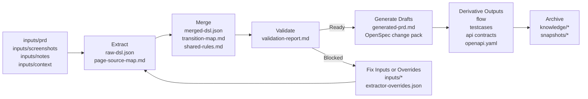
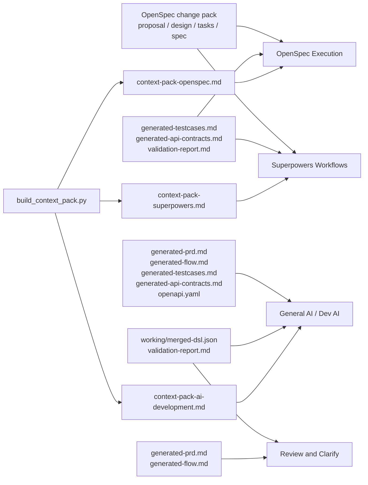

# prd-spec-workspace

A generic requirement-to-spec workspace for turning PRDs, screenshots, notes, and context files into structured DSL, reviewable specs, OpenSpec change packs, test cases, flows, API drafts, and reusable context packs.

Chinese version: [README_CN.md](README_CN.md).

## Start Here

If you are opening this repository for the first time, start from these entry points:

- [Documentation Index](docs/README.md)
- [Chinese Documentation Index](docs/README_CN.md)
- [README_CN.md](README_CN.md)
- [GUIDE_CN.md](GUIDE_CN.md)
- [New Requirement SOP (CN)](docs/new-requirement-sop_cn.md)
- [Artifact Usage Guide (CN)](docs/artifact-usage-guide_cn.md)
- [Context Pack Assembly Guide (CN)](docs/context-pack-assembly-guide_cn.md)
- [AI Dialogue Requirement Workflow](docs/ai-dialogue-requirement-workflow.md)

## What This Project Is

This repository is a tooling workspace for multimodal requirement understanding and spec generation.

It helps teams take mixed requirement inputs such as:

- product requirement documents
- Word PRDs and Excel requirement tables
- screenshots or prototypes
- meeting notes
- interface or permission context
- flow descriptions or diagrams

and convert them into a consistent set of structured outputs.

The core idea is:

`raw requirement materials -> structured DSL -> validation -> spec artifacts -> reusable knowledge`

This project is tool-oriented, not business-template-oriented.

## Structured Understanding and Confidence Transparency

The platform improves quality through two principles:

- normalize multimodal requirement inputs into a structured intermediate layer before drafting outputs
- expose evidence and confidence so users can review what is solid, inferred, or still uncertain

Its goal remains multimodal requirement recognition and conversion into executable spec artifacts.

## End-to-End Flow



## What Users Actually Get

After one requirement run, a team usually gets three kinds of value:

- a structured requirement core for understanding and validation
- reviewable specs for product, QA, and engineering alignment
- ready-to-copy context packs for downstream execution tools

## Supported Input Sources

Place raw materials under `inputs/`. The same extraction pipeline can read common product requirement sources:

- `inputs/prd/`: `.md`, `.txt`, `.docx`, `.xlsx`, `.xls`, `.csv`, `.tsv`, `.json`, `.yaml`, `.html`
- `inputs/notes/`: clarification notes, meeting notes, supplement tables, and edge-case lists in the same formats
- `inputs/context/`: API tables, permission matrices, state tables, glossary files, and integration context in the same formats
- `inputs/screenshots/`: `.png`, `.jpg`, `.jpeg`, `.webp`, `.bmp`

Use `.docx` and `.xlsx` when possible. Legacy `.xls` is supported when `xlrd` is available in the Python environment; legacy `.doc` should be converted first.

## Output-to-Tool Map



## Three Ways to Use the Platform

### 1. Dialogue-first AI usage

Use this mode when the requirement is new, ambiguous, or prototype-heavy.

Recommended flow:

1. Put materials into `inputs/`.
2. Ask AI to do structured recognition first.
3. Review pages, actions, rules, transitions, dependencies, and unknowns.
4. Only continue into Markdown spec generation after the structure looks trustworthy.

A good dialogue prompt is:

```text
This is a new requirement. Please follow the platform rules and do structured recognition first.
Do not write the final draft yet.
Please extract pages, actions, rules, transitions, dependencies, and unknowns from inputs/ first,
and then judge whether the requirement is ready for downstream spec generation.
```

See also:

- [AI Dialogue Requirement Workflow](docs/ai-dialogue-requirement-workflow.md)

### 2. Script-first usage

Use this mode when the inputs are already fairly complete and you want stable engineered outputs.

Recommended flow:

1. Place materials into `inputs/`.
2. Run `python scripts/run_pipeline.py --change-name <change-name> --domain <domain> --title "<title>"`.
3. Review `working/merged-dsl.json` and `working/validation-report.md` after the pipeline generates them.
4. Inspect downstream drafts and derivative outputs.
5. Archive the requirement when stable.

### 3. Vision-enhanced usage

Use this mode when screenshots or prototypes are important evidence and you want multimodal visual evidence plus component verification before DSL extraction. Auxiliary text extraction is only an input source, not the platform goal.

Recommended flow:

1. Put screenshots into `inputs/screenshots/`.
2. Optionally add sidecar text files with the same basename, such as `login.png` with `login.txt`, `login.md`, or `login.json`, when you already have reliable screenshot text.
3. Run `python scripts/run_pipeline.py --change-name <change-name> --domain <domain> --title "<title>" --enable-vision`.
4. Review these intermediate artifacts first:
   - `working/screenshot-evidence.md`
   - `working/screenshot-text-evidence.json` as an internal auxiliary text-evidence file
   - `working/page-classification.json`
5. Then review the merged DSL and validation report.

Rules for vision mode:

- It is optional and should be enabled only when screenshots matter.
- It strengthens the Extract stage; it does not replace validation.
- Screenshot evidence must remain transparent. Low-confidence auxiliary text extraction should be reviewed manually.
- If no auxiliary text source is available, the platform still works through PRD/context and visual-evidence placeholders, but visual confidence remains low.

The key distinction is:

- dialogue-first mode emphasizes AI recognition and judgment first
- script-first mode emphasizes repeatable execution first
- vision-enhanced mode adds multimodal visual evidence and component verification before DSL extraction
- all three still follow the same platform principle: structure first, validate second, generate specs third

## Using It From Cursor Or Another AI IDE

You can use this workspace in three practical ways. Choose one based on where you are working.

### Option A. Open This Workspace Directly

Use this when you want the simplest and most reliable experience.

1. Open this repository in Cursor or another AI IDE.
2. Put requirement materials under `inputs/`.
3. Ask the AI to follow `AGENTS.md`.
4. Run the pipeline or let the AI execute the required steps.

Example prompt:

```text
Please read AGENTS.md and follow the prd-spec-workspace process.
This is a new requirement. Use inputs/ as the source.
First run Extract, Merge, and Validate.
Do not generate the final spec until validation is ready.
```

Example command:

```bash
python scripts/run_pipeline.py --change-name login-register --domain account --title "User Login And Registration"
```

This writes analysis and generated artifacts into this workspace:

- `working/`
- `openspec/changes/`
- `outputs/`
- `knowledge/`

### Option B. Keep Your Business Project Open And Reference This Workspace

Use this when Cursor is currently opened in another project, but you still want this repository to handle requirement analysis.

Requirements:

- the AI agent must be able to access this repository path
- requirement files must be placed under this repository's `inputs/`
- generated requirement artifacts should stay in this repository unless you explicitly ask otherwise

Example prompt:

```text
My current IDE workspace is a business code project.
Do not create requirement-analysis artifacts in the current business project.
Use `<path-to-prd-spec-workspace>` as the requirement workspace.
Read `<path-to-prd-spec-workspace>/AGENTS.md` and follow its rules.
Use `<path-to-prd-spec-workspace>/inputs/` as the requirement source.
First generate raw-dsl, merged-dsl, and validation-report.
Do not generate the final spec until validation passes.
```

Replace `<path-to-prd-spec-workspace>` with your local clone path, for example `D:\tools\prd-spec-workspace` on Windows or `/Users/me/tools/prd-spec-workspace` on macOS/Linux.

You can also run the workspace pipeline from the business project's terminal by using the absolute script path:

```bash
python <path-to-prd-spec-workspace>/scripts/run_pipeline.py --change-name login-register --domain account --title "User Login And Registration"
```

This works because `run_pipeline.py` resolves the requirement workspace from its own file location.

If you later want to implement the requirement in the business code project, pass the generated development context back to the current project:

```text
Please read `<path-to-prd-spec-workspace>/working/context-pack-ai-development.md`
and use it as the implementation context for the current business project.
```

### Option C. Add A Cursor Rule To A Business Project

Use this when a team wants to invoke this requirement workspace while staying inside a business code repository.

In the business project, create:

```text
.cursor/rules/prd-spec-workspace.mdc
```

Paste this rule and adjust the workspace path if needed:

```md
---
description: Use prd-spec-workspace for requirement structuring and spec generation
globs:
  - "**/*"
alwaysApply: true
---

When the user asks to analyze PRD, screenshots, prototypes, Word files, Excel files, notes, or requirement context, use `<path-to-prd-spec-workspace>` as the requirement workspace.

Do not create requirement-analysis artifacts in the business code project unless the user explicitly asks.

Read and follow:
- `<path-to-prd-spec-workspace>/AGENTS.md`
- `<path-to-prd-spec-workspace>/README.md`

Use these input folders:
- `<path-to-prd-spec-workspace>/inputs/prd/`
- `<path-to-prd-spec-workspace>/inputs/screenshots/`
- `<path-to-prd-spec-workspace>/inputs/notes/`
- `<path-to-prd-spec-workspace>/inputs/context/`

Always run the process in this order:
1. Extract
2. Merge
3. Validate
4. Generate only after validation is ready
5. Generate derivative outputs
6. Archive only when the user confirms

Always separate confirmed facts, structured inferences, and unknowns.
Never guess uncertain content.
Never write unknowns as confirmed facts.
```

After adding the rule, use this prompt from the business project:

```text
Please use prd-spec-workspace to process the new requirement in its inputs/ folder.
Run Extract, Merge, and Validate first.
Stop before final generation if validation has blockers.
```

To verify the rule is active, ask the AI:

```text
Please confirm which requirement workspace path you will use before processing this requirement.
```

## Quick Start

```bash
python scripts/bootstrap_outputs.py --change-name demo-change --domain account
python scripts/run_pipeline.py --change-name demo-change --domain account --title "Sample Requirement"
python scripts/run_pipeline.py --change-name demo-change --domain account --title "Sample Requirement" --enable-vision
python scripts/build_context_pack.py --target openspec --change-name demo-change --domain account --title "Sample Requirement"
python scripts/archive_spec.py --change-name demo-change --domain account --title "Sample Requirement"
```

## Documentation

Start with the documentation index:

- [Documentation Index](docs/README.md)
- [Chinese Documentation Index](docs/README_CN.md)
- [Artifact Usage Guide (CN)](docs/artifact-usage-guide_cn.md)
- [Context Pack Assembly Guide (CN)](docs/context-pack-assembly-guide_cn.md)
- [AI Dialogue Requirement Workflow](docs/ai-dialogue-requirement-workflow.md)
- [Structured Understanding and Confidence Notes (CN)](docs/structured-understanding-confidence_cn.md)
- [Visual Evidence Extension Guide (CN)](docs/visual-evidence-extension-guide_cn.md)
- [GUIDE_CN.md](GUIDE_CN.md)

## Testing

```bash
python -m unittest tests.test_extract_initial_dsl tests.test_extract_screenshot_evidence tests.test_manage_extractor_overrides tests.test_validate_dsl tests.test_generate_drafts tests.test_generate_derivatives tests.test_run_pipeline tests.test_archive_spec tests.test_select_context tests.test_build_context_pack tests.test_accuracy_examples -v
```
