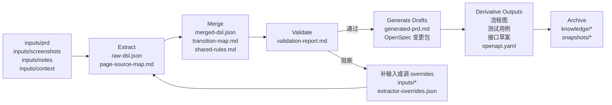

# prd-spec-workspace

通用的需求结构化与规格生成工作区，用于把 PRD、截图、备注、上下文等原始材料，转换为结构化 DSL、可评审规格稿、OpenSpec 变更包、Superpowers 输入、测试用例、流程图和接口草案。

English version: [README.md](D:/spring_AI/prd-spec-workspace/README.md)

## 项目定位

这个仓库是一个“需求材料 -> 结构化规格”的工具型工作区。

它适合处理以下输入：

- 产品需求文档
- 页面截图或原型
- 会议纪要和补充说明
- 接口、权限、系统上下文
- 流程说明或流程图证据

核心链路是：

`原始需求材料 -> DSL -> 校验 -> 规格产物 -> 知识归档`

这个项目的目标不是内置固定业务模板，而是保持通用性，并允许用户通过配置持续优化抽取效果。

## 整体流程图



## 为什么使用它

当团队希望做到这些事时，这个仓库会比较有价值：

- 在开发前尽量减少需求歧义
- 让需求分析更结构化、更可复用
- 明确区分“已确认事实 / 结构化推断 / 待确认项”
- 从同一份需求上下文生成多类产物
- 把稳定知识沉淀下来，避免每次从零理解
- 给 AI 协作提供更稳定、更可评审的上下文输入

## 核心能力

### 1. 需求抽取

从 `inputs/` 中读取材料，生成包含以下信息的结构化 DSL：

- 页面
- 流转
- 规则
- 依赖
- 待确认项

### 2. 先校验，再生成

在生成下游规格之前，先对 DSL 做质量校验，重点发现：

- 孤立页面
- 缺少出口的页面
- 非法流转
- 重复 id
- 依赖未声明
- 抽取结果噪声过大或结构不完整

### 3. 多产物生成

从同一份 DSL 可生成：

- Markdown 需求稿
- OpenSpec proposal / design / tasks / spec
- 流程图
- 测试用例
- 接口契约草案
- OpenAPI YAML 骨架

### 4. 知识归档

需求完成后，可以将稳定结果归档到 `knowledge/`，既保留上下文，又避免污染下一次活动需求。

### 5. 用户可扩展抽取器

用户可以不修改 Python 主逻辑，而是通过：

- `extractor-overrides.json`
- `scripts/manage_extractor_overrides.py`

来自行扩展词表、规则分类和章节识别。

## 用户最终能得到什么

这个平台的价值不只是“生成了一堆文件”，而是这些文件可以继续驱动后续研发动作。

一次完整运行后，团队通常会得到三类核心价值：

- 一套可校验的结构化需求核心
- 一套可评审、可实现的规格产物
- 一套可直接复制给下游工具的上下文包

也就是说，这个平台能把原始需求材料进一步转成：

- 需求澄清和范围收口材料
- OpenSpec 执行计划输入
- Superpowers 规划 / 实现 / 验收输入
- 通用 AI / 开发 AI 的稳定上下文
- 可复用的知识资产和历史快照

## 产物怎么继续用

### 1. 用于需求评审和澄清

当团队想先看懂需求、发现歧义和待确认项时，优先看：

- `working/merged-dsl.json`
- `working/validation-report.md`
- `working/generated-prd.md`
- `working/generated-flow.md`

### 2. 用于 OpenSpec 执行链路

当下一步是做变更计划、执行计划或任务拆解时，优先使用：

- `openspec/changes/<change-name>/proposal.md`
- `openspec/changes/<change-name>/design.md`
- `openspec/changes/<change-name>/tasks.md`
- `openspec/changes/<change-name>/specs/<domain>/spec.md`
- 再补 `working/validation-report.md` 作为风险边界

### 3. 用于 Superpowers 工作流

当下一步是继续做设计收口、实现计划、实现辅助或验收辅助时，优先使用：

- OpenSpec 变更包
- `working/generated-testcases.md`
- `working/generated-api-contracts.md`
- `working/generated-flow.md`
- `working/validation-report.md`

### 4. 用于通用 AI / 开发 AI

当下一步是 AI 辅助编码、测试设计、接口分析或需求理解时，优先使用：

- `working/generated-prd.md`
- `working/generated-flow.md`
- `working/generated-testcases.md`
- `working/generated-api-contracts.md`
- `working/api-contracts/openapi.yaml`
- `working/validation-report.md`
- 必要时再补 `working/merged-dsl.json`

## 上下文包能力

现在项目已经支持把当前工作区产物一键组装成可复制的 Markdown 上下文包。

使用：

```bash
python scripts/build_context_pack.py --target openspec --change-name my-change --domain account --title "我的需求"
python scripts/build_context_pack.py --target superpowers --change-name my-change --domain account --title "我的需求" --goal "实现计划与实现辅助"
python scripts/build_context_pack.py --target ai-development --change-name my-change --domain account --title "我的需求"
```

默认输出：

- `working/context-pack-openspec.md`
- `working/context-pack-superpowers.md`
- `working/context-pack-ai-development.md`

这些文件的目标很明确：让团队可以直接复制给 OpenSpec、Superpowers 或其他 AI 工具，而不需要每次手工重新拼装上下文。

## 标准产物

### Working 产物

- `working/page-source-map.md`
- `working/raw-dsl.json`
- `working/transition-map.md`
- `working/shared-rules.md`
- `working/merged-dsl.json`
- `working/validation-report.md`
- `working/generated-prd.md`
- `working/generated-flow.md`
- `working/generated-testcases.md`
- `working/generated-api-contracts.md`
- `working/api-contracts/openapi.yaml`

### OpenSpec 变更包

- `openspec/changes/<change-name>/proposal.md`
- `openspec/changes/<change-name>/design.md`
- `openspec/changes/<change-name>/tasks.md`
- `openspec/changes/<change-name>/specs/<domain>/spec.md`

### 对外分享产物

- `outputs/diagrams/`
- `outputs/testcases/`
- `outputs/contracts/`

### 知识归档产物

- `knowledge/specs/`
- `knowledge/patterns/`
- `knowledge/rules/`
- `knowledge/api/`
- `knowledge/decisions/`
- `knowledge/snapshots/`

## 仓库结构

```text
inputs/
  prd/
  screenshots/
  notes/
  context/

scripts/
  bootstrap_outputs.py
  extract_initial_dsl.py
  validate_dsl.py
  generate_drafts.py
  generate_derivatives.py
  render_mermaid_assets.py
  archive_spec.py
  select_context.py
  manage_extractor_overrides.py
  build_context_pack.py
  run_pipeline.py

working/
openspec/
outputs/
knowledge/
docs/
prompts/
tests/
examples/
```

## 快速开始

### 1. 初始化工作区

```bash
python scripts/bootstrap_outputs.py --change-name demo-change --domain account
```

### 2. 把材料放入 `inputs/`

推荐最低配置：

- 一份 PRD 或等价需求说明
- 一份 notes
- 如果涉及接口或权限，一份 context

最佳输入组合：

- `prd + screenshots + notes + context + 流程证据`

### 3. 运行流水线

```bash
python scripts/run_pipeline.py --change-name demo-change --domain account --title "示例需求"
```

### 4. 评审生成结果

重点查看：

- `working/merged-dsl.json`
- `working/validation-report.md`
- `working/generated-prd.md`
- `working/generated-flow.md`
- `working/generated-testcases.md`
- `working/generated-api-contracts.md`

### 5. 组装上下文包

```bash
python scripts/build_context_pack.py --target openspec --change-name demo-change --domain account --title "示例需求"
```

### 6. 归档稳定需求

```bash
python scripts/archive_spec.py --change-name demo-change --domain account --title "示例需求"
```

## 常用命令

```bash
python scripts/bootstrap_outputs.py --change-name my-change --domain account
python scripts/extract_initial_dsl.py --workspace .
python scripts/validate_dsl.py
python scripts/run_pipeline.py --change-name my-change --domain account --title "我的需求"
python scripts.build_context_pack.py --target openspec --change-name my-change --domain account --title "我的需求"
python scripts/archive_spec.py --change-name my-change --domain account --title "我的需求"
python scripts/select_context.py --list
```

## 扩展抽取器

如果你的团队有领域词汇，不建议第一时间改主代码。

优先使用扩展配置：

```bash
python scripts/manage_extractor_overrides.py --init
python scripts/manage_extractor_overrides.py --show
python scripts/manage_extractor_overrides.py --add-page-suffix 看板
python scripts/manage_extractor_overrides.py --add-action-prefix 导出
python scripts/manage_extractor_overrides.py --add-rule-keyword 实时刷新
python scripts/manage_extractor_overrides.py --add-rule-category 报表规则 --add-category-keyword 实时刷新
```

详细说明：

- [Extractor Overrides Guide](D:/spring_AI/prd-spec-workspace/docs/extractor-overrides.md)
- [提取器扩展配置使用指南](D:/spring_AI/prd-spec-workspace/docs/extractor-overrides_cn.md)

## 文档导航

- [README.md](D:/spring_AI/prd-spec-workspace/README.md)
- [guide.md](D:/spring_AI/prd-spec-workspace/guide.md)
- [GUIDE_CN.md](D:/spring_AI/prd-spec-workspace/GUIDE_CN.md)
- [团队直接使用清单](D:/spring_AI/prd-spec-workspace/docs/direct-use-checklist.md)
- [新需求标准操作 SOP](D:/spring_AI/prd-spec-workspace/docs/new-requirement-sop_cn.md)
- [项目总手册](D:/spring_AI/prd-spec-workspace/docs/project-handbook_cn.md)
- [产物使用说明](D:/spring_AI/prd-spec-workspace/docs/artifact-usage-guide_cn.md)
- [标准上下文包模板](D:/spring_AI/prd-spec-workspace/docs/context-pack-templates/README_CN.md)
- [上下文包组装指南](D:/spring_AI/prd-spec-workspace/docs/context-pack-assembly-guide_cn.md)
- [提取器扩展配置使用指南](D:/spring_AI/prd-spec-workspace/docs/extractor-overrides_cn.md)
- [Contributing](D:/spring_AI/prd-spec-workspace/CONTRIBUTING.md)
- [CHANGELOG](D:/spring_AI/prd-spec-workspace/CHANGELOG.md)

## 示例

- [Examples README](D:/spring_AI/prd-spec-workspace/examples/README.md)
- [auth-basic](D:/spring_AI/prd-spec-workspace/examples/auth-basic)
- [payment-refund](D:/spring_AI/prd-spec-workspace/examples/payment-refund)
- [reporting-dashboard](D:/spring_AI/prd-spec-workspace/examples/reporting-dashboard)

## 测试

```bash
python -m unittest tests.test_extract_initial_dsl tests.test_manage_extractor_overrides tests.test_validate_dsl tests.test_generate_drafts tests.test_generate_derivatives tests.test_run_pipeline tests.test_archive_spec tests.test_select_context tests.test_build_context_pack -v
```

## 贡献方式

- [Contributing](D:/spring_AI/prd-spec-workspace/CONTRIBUTING.md)
- [.github/ISSUE_TEMPLATE/bug_report.md](D:/spring_AI/prd-spec-workspace/.github/ISSUE_TEMPLATE/bug_report.md)
- [.github/ISSUE_TEMPLATE/feature_request.md](D:/spring_AI/prd-spec-workspace/.github/ISSUE_TEMPLATE/feature_request.md)

## 许可证

- [LICENSE](D:/spring_AI/prd-spec-workspace/LICENSE)
