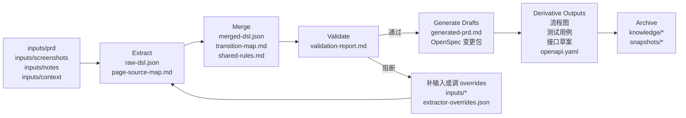
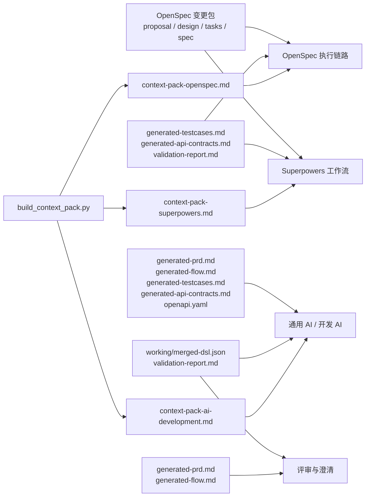

# prd-spec-workspace

通用的需求结构化与规格生成工作区，用于把 PRD、截图、备注、上下文等原始材料，转换为结构化 DSL、可评审规格稿、OpenSpec 变更包、Superpowers 输入、测试用例、流程图和接口草案。

English version: [README.md](D:/spring_AI/prd-spec-workspace/README.md)

## 项目定位

这个仓库是一个“需求材料 -> 结构化规格”的工具型工作区。

它适合处理以下输入：

- 产品需求文档
- 页面截图或原型
- 会议纪要和补充说明
- 接口、权限、系统上下文
- 流程说明或流程图证据

核心链路是：

`原始需求材料 -> DSL -> 校验 -> 规格产物 -> 知识归档`

项目目标不是内置固定业务模板，而是保持通用性，并允许用户通过配置持续优化抽取效果。

## 结构化理解与可信度透明

平台强调两件事：

- 把多模态需求材料先统一收口到结构层，而不是直接写终稿
- 把识别结果的证据和可信度一起暴露出来，方便人工复核

这也是平台提升准确度和可信度的关键方式。

## 整体流程图



## 核心能力

- 从多模态输入抽取页面、动作、规则、依赖、流转、unknowns
- 在生成前进行结构和语义校验，提前暴露风险
- 生成 PRD 阅读稿、OpenSpec 变更包、流程图、测试稿、接口草案和 OpenAPI 骨架
- 输出可直接复制给 OpenSpec、Superpowers、通用 AI 的上下文包
- 归档稳定知识，避免旧需求污染下一轮识别

## 用户最终能得到什么

一次完整运行后，团队通常会得到三类核心价值：

- 一套可校验的结构化需求核心
- 一套可评审、可实现的规格产物
- 一套可直接复制给下游工具的上下文包

## 产物到下游工具的关系



## 快速开始

### 1. 初始化工作区

```bash
python scripts/bootstrap_outputs.py --change-name demo-change --domain account
```

### 2. 把材料放入 `inputs/`

推荐最低配置：

- 一份 PRD 或等价需求说明
- 一份 notes
- 如果涉及接口或权限，一份 context

### 3. 运行流水线

```bash
python scripts/run_pipeline.py --change-name demo-change --domain account --title "示例需求"
```

### 4. 评审生成结果

重点查看：

- `working/merged-dsl.json`
- `working/validation-report.md`
- `working/generated-prd.md`
- `working/generated-flow.md`
- `working/generated-testcases.md`
- `working/generated-api-contracts.md`

### 5. 组装上下文包

```bash
python scripts/build_context_pack.py --target openspec --change-name demo-change --domain account --title "示例需求"
```

### 6. 归档稳定需求

```bash
python scripts/archive_spec.py --change-name demo-change --domain account --title "示例需求"
```

## 常用命令

```bash
python scripts/bootstrap_outputs.py --change-name my-change --domain account
python scripts/extract_initial_dsl.py --workspace .
python scripts/validate_dsl.py
python scripts/run_pipeline.py --change-name my-change --domain account --title "我的需求"
python scripts/build_context_pack.py --target openspec --change-name my-change --domain account --title "我的需求"
python scripts/archive_spec.py --change-name my-change --domain account --title "我的需求"
python scripts/select_context.py --list
```

## 文档导航

推荐先从文档中心进入：

- [文档中心](D:/spring_AI/prd-spec-workspace/docs/README_CN.md)
- [新需求标准操作 SOP](D:/spring_AI/prd-spec-workspace/docs/new-requirement-sop_cn.md)
- [产物使用说明](D:/spring_AI/prd-spec-workspace/docs/artifact-usage-guide_cn.md)
- [上下文包组装指南](D:/spring_AI/prd-spec-workspace/docs/context-pack-assembly-guide_cn.md)
- [结构化理解与可信度说明](D:/spring_AI/prd-spec-workspace/docs/structured-understanding-confidence_cn.md)
- [GUIDE_CN.md](D:/spring_AI/prd-spec-workspace/GUIDE_CN.md)
- [README.md](D:/spring_AI/prd-spec-workspace/README.md)

## 示例

- [Examples README](D:/spring_AI/prd-spec-workspace/examples/README.md)
- [auth-basic](D:/spring_AI/prd-spec-workspace/examples/auth-basic)
- [payment-refund](D:/spring_AI/prd-spec-workspace/examples/payment-refund)
- [reporting-dashboard](D:/spring_AI/prd-spec-workspace/examples/reporting-dashboard)
- [approval-workflow](D:/spring_AI/prd-spec-workspace/examples/approval-workflow)
- [ticket-lifecycle](D:/spring_AI/prd-spec-workspace/examples/ticket-lifecycle)

## 测试

```bash
python -m unittest tests.test_extract_initial_dsl tests.test_manage_extractor_overrides tests.test_validate_dsl tests.test_generate_drafts tests.test_generate_derivatives tests.test_run_pipeline tests.test_archive_spec tests.test_select_context tests.test_build_context_pack tests.test_accuracy_examples -v
```
