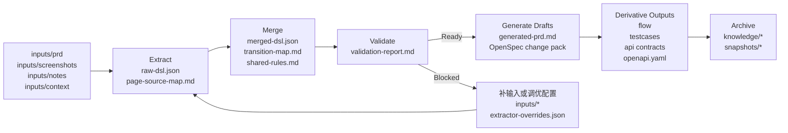
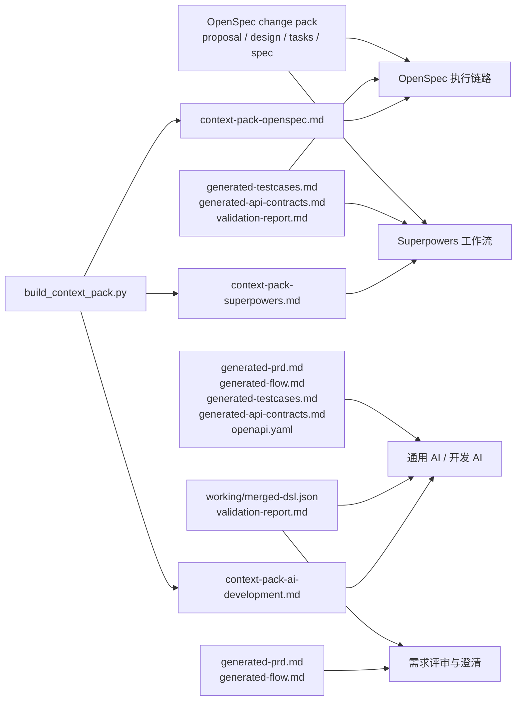

# prd-spec-workspace

通用的需求结构化与规格生成工作区，用于把 PRD、截图、备注、上下文说明等原始材料，转换为结构化 DSL、可评审规格稿、OpenSpec 变更包、测试用例、流程图、接口草案和可复用上下文包。

English version: [README.md](D:/spring_AI/prd-spec-workspace/README.md)

## 从这里开始

如果你是第一次打开这个仓库，建议先看这些入口：

- [文档中心](D:/spring_AI/prd-spec-workspace/docs/README_CN.md)
- [英文文档中心](D:/spring_AI/prd-spec-workspace/docs/README.md)
- [GUIDE_CN.md](D:/spring_AI/prd-spec-workspace/GUIDE_CN.md)
- [新需求标准操作 SOP](D:/spring_AI/prd-spec-workspace/docs/new-requirement-sop_cn.md)
- [产物使用说明](D:/spring_AI/prd-spec-workspace/docs/artifact-usage-guide_cn.md)
- [上下文包组装指南](D:/spring_AI/prd-spec-workspace/docs/context-pack-assembly-guide_cn.md)
- [AI 对话式需求识别工作流](D:/spring_AI/prd-spec-workspace/docs/ai-dialogue-requirement-workflow_cn.md)
- [结构化理解与可信度说明](D:/spring_AI/prd-spec-workspace/docs/structured-understanding-confidence_cn.md)
- [inputs/README_CN.md](D:/spring_AI/prd-spec-workspace/inputs/README_CN.md)
- [prompts/README_CN.md](D:/spring_AI/prd-spec-workspace/prompts/README_CN.md)
- [scripts/README_CN.md](D:/spring_AI/prd-spec-workspace/scripts/README_CN.md)
- [tests/README_CN.md](D:/spring_AI/prd-spec-workspace/tests/README_CN.md)
- [examples/README_CN.md](D:/spring_AI/prd-spec-workspace/examples/README_CN.md)

## 项目定位

这个仓库是一个“原始需求材料 -> 结构化规格”的工具型工作区。

它适合处理以下输入：

- 产品需求文档
- 页面截图或原型
- 会议纪要和补充说明
- 接口、权限、系统上下文
- 流程说明或流程图证据

核心链路是：

`原始需求材料 -> 结构化 DSL -> 校验 -> 规格产物 -> 知识归档`

这个项目的中心思想是工具化，不绑定固定业务模板。

## 结构化理解与可信度透明

平台通过两件事提升质量：

- 先把多模态需求材料统一收口到结构化中间层，再进入规格生成
- 把证据和可信度显式输出，便于用户判断哪些是事实、哪些是推断、哪些仍需确认

目标始终是：多模态需求识别与规格转换，而不是直接自由生成终稿。

## 整体流程



## 使用者最终能得到什么

一次需求处理后，团队通常会得到三类价值：

- 便于理解和校验的结构化需求核心
- 可供产品、测试、研发共同评审的规格草案
- 可以直接复制给下游工具的上下文包

## 产物流向图



## 三种使用方式

### 1. 对话式 AI 使用

当需求是全新的、有歧义的、或者以原型为主时，推荐先走对话式识别。

推荐流程：

1. 先把材料放进 `inputs/`
2. 先让 AI 按平台规则做结构化识别
3. 先检查页面、动作、规则、流转、依赖和 unknowns
4. 只有在结构层看起来可信时，再进入 Markdown 规格生成

推荐对话说法：

```text
这是一个新需求，请按平台规则先做结构化识别。
先不要直接写终稿。
请先基于 inputs/ 提取页面、动作、规则、流转、依赖、unknowns，
再判断是否可以继续生成规格稿。
```

参考文档：

- [AI 对话式需求识别工作流](D:/spring_AI/prd-spec-workspace/docs/ai-dialogue-requirement-workflow_cn.md)

### 2. 脚本式使用

当输入已经相对完整，并且你希望快速得到稳定的工程化产物时，推荐走脚本式使用。

推荐流程：

1. 先把材料放进 `inputs/`
2. 执行 `python scripts/run_pipeline.py --change-name <change-name> --domain <domain> --title "<需求标题>"`
3. 先检查 [merged-dsl.json](D:/spring_AI/prd-spec-workspace/working/merged-dsl.json) 和 [validation-report.md](D:/spring_AI/prd-spec-workspace/working/validation-report.md)
4. 再检查下游规格稿和派生产物
5. 稳定后执行归档

### 3. OCR / 视觉增强使用

当截图或原型是关键证据，并且你希望在 DSL 抽取前先做 OCR 和组件核对时，推荐开启视觉增强。

推荐流程：

1. 把截图放进 `inputs/screenshots/`
2. 如有条件，为截图补同名侧车 OCR 文件，例如：
   - `login.png` 对应 `login.ocr.txt`
   - `login.png` 对应 `login.ocr.md`
   - `login.png` 对应 `login.ocr.json`
3. 执行：
   `python scripts/run_pipeline.py --change-name <change-name> --domain <domain> --title "<需求标题>" --enable-vision`
4. 优先检查这些中间产物：
   - [screenshot-evidence.md](D:/spring_AI/prd-spec-workspace/working/screenshot-evidence.md)
   - [screenshot-ocr.json](D:/spring_AI/prd-spec-workspace/working/screenshot-ocr.json)
   - [page-classification.json](D:/spring_AI/prd-spec-workspace/working/page-classification.json)
5. 再检查 `merged-dsl.json` 和 `validation-report.md`

视觉增强规则：

- 它是可选增强，不是默认强制步骤
- 它只增强 Extract 阶段，不替代 validation
- 截图证据必须透明输出，低可信度 OCR 结果需要人工复核
- 如果本地没有 `tesseract`，平台仍可运行，但没有侧车 OCR 文件时，视觉证据会保持低可信度

三种方式的区别是：

- 对话式更强调 AI 先识别、先判断
- 脚本式更强调流程稳定执行
- 视觉增强式是在抽取前增加 OCR 和组件核对
- 三者都遵循同一个原则：先结构化理解，再校验，再生成规格

## 快速开始

```bash
python scripts/bootstrap_outputs.py --change-name demo-change --domain account
python scripts/run_pipeline.py --change-name demo-change --domain account --title "示例需求"
python scripts/run_pipeline.py --change-name demo-change --domain account --title "示例需求" --enable-vision
python scripts/build_context_pack.py --target openspec --change-name demo-change --domain account --title "示例需求"
python scripts/archive_spec.py --change-name demo-change --domain account --title "示例需求"
```

## 文档导航

推荐先从文档中心进入：

- [文档中心](D:/spring_AI/prd-spec-workspace/docs/README_CN.md)
- [项目总手册](D:/spring_AI/prd-spec-workspace/docs/project-handbook_cn.md)
- [产物使用说明](D:/spring_AI/prd-spec-workspace/docs/artifact-usage-guide_cn.md)
- [上下文包组装指南](D:/spring_AI/prd-spec-workspace/docs/context-pack-assembly-guide_cn.md)
- [AI 对话式需求识别工作流](D:/spring_AI/prd-spec-workspace/docs/ai-dialogue-requirement-workflow_cn.md)
- [结构化理解与可信度说明](D:/spring_AI/prd-spec-workspace/docs/structured-understanding-confidence_cn.md)
- [inputs/README_CN.md](D:/spring_AI/prd-spec-workspace/inputs/README_CN.md)
- [prompts/README_CN.md](D:/spring_AI/prd-spec-workspace/prompts/README_CN.md)
- [scripts/README_CN.md](D:/spring_AI/prd-spec-workspace/scripts/README_CN.md)
- [tests/README_CN.md](D:/spring_AI/prd-spec-workspace/tests/README_CN.md)
- [examples/README_CN.md](D:/spring_AI/prd-spec-workspace/examples/README_CN.md)

## 测试

```bash
python -m unittest tests.test_extract_initial_dsl tests.test_extract_screenshot_evidence tests.test_manage_extractor_overrides tests.test_validate_dsl tests.test_generate_drafts tests.test_generate_derivatives tests.test_run_pipeline tests.test_archive_spec tests.test_select_context tests.test_build_context_pack tests.test_accuracy_examples -v
```
