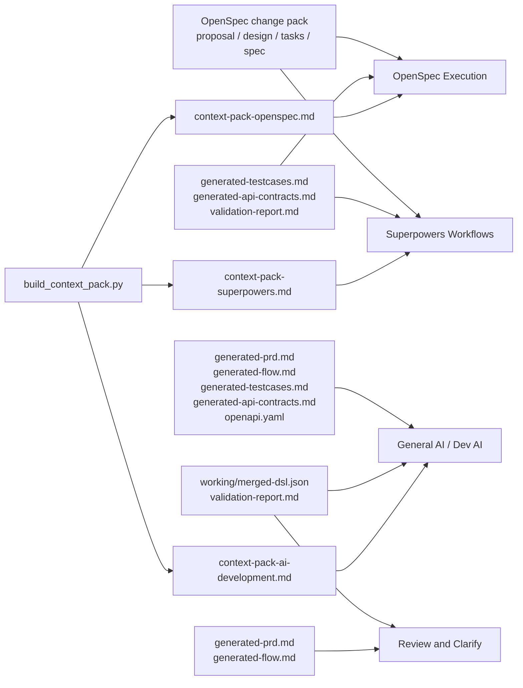

# prd-spec-workspace

`prd-spec-workspace` 是一个通用的多模态需求识别与规格生成工作区，用于把 PRD、Word 文档、Excel 表格、截图、原型、备注、接口上下文和流程说明转换为结构化 DSL、可审阅规格、OpenSpec 变更包、测试用例、流程图、接口草案和可复用上下文包。

English version: [README.md](README.md)。

## 快速入口

第一次使用建议从这些文档开始：

- [文档中心](docs/README_CN.md)
- [英文文档中心](docs/README.md)
- [操作指南](GUIDE_CN.md)
- [新需求标准 SOP](docs/new-requirement-sop_cn.md)
- [产物使用说明](docs/artifact-usage-guide_cn.md)
- [上下文包组装指南](docs/context-pack-assembly-guide_cn.md)
- [AI 对话式需求识别流程](docs/ai-dialogue-requirement-workflow_cn.md)
- [结构化理解与可信度说明](docs/structured-understanding-confidence_cn.md)
- [多模态视觉证据扩展说明](docs/visual-evidence-extension-guide_cn.md)

## 平台定位

这个项目不是固定业务模板，也不是某个单一识别工具。它是一个面向任意产品需求的“需求材料到规格产物”工作区。

核心流程是：

`原始需求材料 -> 结构化 DSL -> 校验 -> 规格产物 -> 可复用知识`

平台强调先理解、再校验、再生成，避免直接根据零散材料写出看似完整但不可验证的终稿。

## 整体流程


## 支持的需求来源

原始材料统一放入 `inputs/`，平台会在抽取阶段读取并转成结构化证据：

- `inputs/prd/`：`.md`、`.txt`、`.docx`、`.xlsx`、`.xls`、`.csv`、`.tsv`、`.json`、`.yaml`、`.html`
- `inputs/notes/`：会议纪要、口头补充、边界条件、澄清表、补充规则，支持同样格式
- `inputs/context/`：API 表、权限矩阵、状态表、术语表、集成依赖说明，支持同样格式
- `inputs/screenshots/`：`.png`、`.jpg`、`.jpeg`、`.webp`、`.bmp`

Office 文件优先使用 `.docx` 和 `.xlsx`。旧版 `.xls` 在当前 Python 环境安装 `xlrd` 时可直接解析；旧版 `.doc` 建议先转换。

## 你可以得到什么

一次需求运行后，团队通常会得到三类产物：

- 结构化需求核心：`raw-dsl.json`、`merged-dsl.json`、`validation-report.md`
- 协作评审文档：`generated-prd.md`、流程图、测试用例、接口草案
- 下游执行上下文：OpenSpec 变更包、Superpowers 上下文包、AI 开发上下文包

## 对接工具



## 三种使用方式

### 1. 对话式 AI 使用

适合新需求、原型重、信息不完整或需要先判断可行性的场景。

推荐提示词：

```text
这是一个新需求，请按平台规则先做结构化识别。
先不要直接写终稿。
请先基于 inputs/ 提取页面、动作、规则、流转、依赖、unknowns，
再判断是否可以继续生成规格稿。
```

这类方式由 AI 先做结构化识别和可信度判断，团队确认后再进入规格稿生成。

### 2. 脚本式使用

适合输入材料已经较完整，希望稳定生成标准产物的场景。

```bash
python scripts/run_pipeline.py --change-name <change-name> --domain <domain> --title "<需求标题>"
```

运行后先检查：

- `working/merged-dsl.json`
- `working/validation-report.md`
- `working/generated-prd.md`

### 3. 多模态视觉增强

适合截图、原型、流程图对需求理解很关键的场景。该模式会先生成视觉证据、页面分类和组件核对结果，再并入 DSL 抽取。

```bash
python scripts/run_pipeline.py --change-name <change-name> --domain <domain> --title "<需求标题>" --enable-vision
```

如果你已经有可靠的截图文字信息，可以添加同名侧车文件：

- `login.png` + `login.txt`
- `login.png` + `login.md`
- `login.png` + `login.json`

需要先检查的中间文件：

- `working/screenshot-evidence.md`
- `working/screenshot-text-evidence.json`
- `working/page-classification.json`

辅助文字提取只是多模态理解流程中的证据来源，不是最终产物目标。最终规格仍必须区分已确认事实、结构化推断和待确认项。

## 在 Cursor 或其他 AI IDE 中使用

这个工作台可以用三种方式接入。请根据当前打开的项目选择一种。

### 方式 A：直接打开本工作台

这是最简单、最稳定的方式，适合第一次体验或专门做需求分析。

1. 在 Cursor 或其他 AI IDE 中打开本仓库。
2. 把需求材料放入 `inputs/`。
3. 让 AI 先读取并遵守 `AGENTS.md`。
4. 运行脚本，或者让 AI 按流程执行 Extract、Merge、Validate。

推荐提示词：

```text
请阅读 AGENTS.md，并严格按 prd-spec-workspace 流程执行。
这是一个新需求，请基于 inputs/ 作为需求来源。
先执行 Extract、Merge、Validate。
validation 没有通过前，不要直接生成最终规格稿。
```

推荐命令：

```bash
python scripts/run_pipeline.py --change-name login-register --domain account --title "用户登录注册需求"
```

产物会写入当前工作台：

- `working/`
- `openspec/changes/`
- `outputs/`
- `knowledge/`

### 方式 B：当前打开业务项目，但引用本工作台

适合你正在 Cursor 中打开业务代码项目，但仍希望用本仓库完成需求分析。

使用前请确认：

- AI Agent 能访问本仓库路径。
- 需求材料已经放入本仓库的 `inputs/`。
- 需求分析产物默认写回本仓库，不污染当前业务项目。

推荐提示词：

```text
当前我打开的是业务代码项目。
请不要在当前业务项目中创建需求分析产物。
请使用 <path-to-prd-spec-workspace> 作为需求规格工作台。
请读取 <path-to-prd-spec-workspace>/AGENTS.md 并遵守它的规则。
请基于 <path-to-prd-spec-workspace>/inputs/ 执行需求结构化识别。
先生成 raw-dsl、merged-dsl、validation-report。
validation 没有通过前，不要生成最终规格稿。
```

请把 `<path-to-prd-spec-workspace>` 替换成你的本地仓库路径，例如 Windows 下可以是 `D:\tools\prd-spec-workspace`，macOS/Linux 下可以是 `/Users/me/tools/prd-spec-workspace`。

也可以在业务项目终端中，用绝对路径直接调用本工作台脚本：

```bash
python <path-to-prd-spec-workspace>/scripts/run_pipeline.py --change-name login-register --domain account --title "用户登录注册需求"
```

该方式可以生效，是因为 `run_pipeline.py` 会根据脚本自身所在位置识别需求工作台根目录，不依赖当前终端所在目录。

如果后续要在当前业务项目里开发，可以继续输入：

```text
请读取 <path-to-prd-spec-workspace>/working/context-pack-ai-development.md，
并把它作为当前业务项目的开发实现上下文。
```

### 方式 C：在业务项目中添加 Cursor Rule

适合团队希望“打开业务项目也能稳定调用需求工作台”的场景。

在业务项目中创建：

```text
.cursor/rules/prd-spec-workspace.mdc
```

写入以下内容。如果你的工作台路径不同，请替换路径：

```md
---
description: Use prd-spec-workspace for requirement structuring and spec generation
globs:
  - "**/*"
alwaysApply: true
---

当用户要求分析 PRD、截图、原型、Word、Excel、备注或需求上下文时，使用 <path-to-prd-spec-workspace> 作为需求规格工作台。

除非用户明确要求，否则不要在当前业务代码项目中创建需求分析产物。

请读取并遵守：
- `<path-to-prd-spec-workspace>/AGENTS.md`
- `<path-to-prd-spec-workspace>/README_CN.md`

需求输入目录：
- `<path-to-prd-spec-workspace>/inputs/prd/`
- `<path-to-prd-spec-workspace>/inputs/screenshots/`
- `<path-to-prd-spec-workspace>/inputs/notes/`
- `<path-to-prd-spec-workspace>/inputs/context/`

必须按以下顺序执行：
1. Extract
2. Merge
3. Validate
4. validation 通过后再 Generate
5. 生成派生产物
6. 用户确认后再 Archive

所有输出必须区分已确认事实、结构化推断和待确认项。
不允许猜测不确定内容。
不允许把待确认项写成既定事实。
```

添加规则后，在业务项目中可以直接输入：

```text
请使用 prd-spec-workspace 处理其 inputs/ 里的新需求。
先执行 Extract、Merge、Validate。
如果 validation 存在阻断问题，请先停止，不要生成最终规格稿。
```

为了确认规则已经生效，可以先问 AI：

```text
请先确认你本次会使用哪个需求工作台路径，再开始处理需求。
```

## 快速命令

```bash
python scripts/bootstrap_outputs.py --change-name demo-change --domain account
python scripts/run_pipeline.py --change-name demo-change --domain account --title "示例需求"
python scripts/run_pipeline.py --change-name demo-change --domain account --title "示例需求" --enable-vision
python scripts/build_context_pack.py --target openspec --change-name demo-change --domain account --title "示例需求"
python scripts/archive_spec.py --change-name demo-change --domain account --title "示例需求"
```

## 推荐使用节奏

1. 把 PRD、Word、Excel、截图、备注和上下文放入 `inputs/`。
2. 先执行结构化识别，检查页面、动作、规则、流转、依赖和 unknowns。
3. 通过 validation 后再生成规格稿、OpenSpec、测试用例和接口草案。
4. 使用上下文包把稳定产物喂给 OpenSpec、Superpowers 或通用 AI 开发工具。
5. 需求稳定后归档到 `knowledge/`，后续新需求按需选择性引用。

## 测试

```bash
python -m unittest tests.test_extract_initial_dsl tests.test_extract_screenshot_evidence tests.test_manage_extractor_overrides tests.test_validate_dsl tests.test_generate_drafts tests.test_generate_derivatives tests.test_run_pipeline tests.test_archive_spec tests.test_select_context tests.test_build_context_pack tests.test_accuracy_examples -v
```
